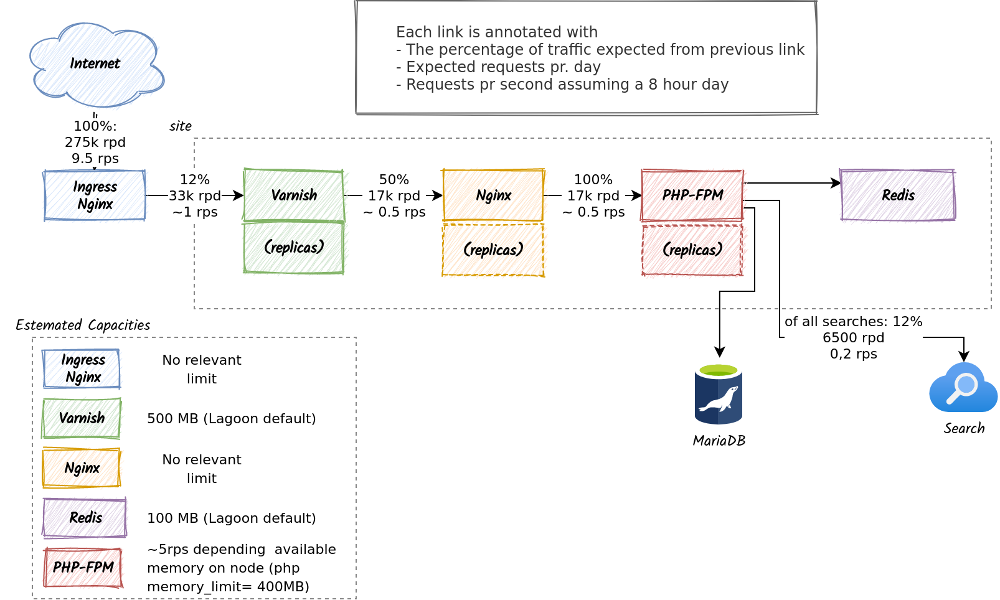

# Architecture Decision Record: Rightsizing

## Context

### Expected traffic


The platform is required to be able to handle an estimated 275.000 page-views
per day spread out over 100 websites. A visit to a website that causes the
browser to request a single html-document followed by a number of assets is only
counted as a single page-view.

On a given day about half of the page-views to be made by an authenticated
user. We further more expect the busiest site receive about 12% of the traffic.

Given these numbers, we can make some estimates of the expected average load.
To stay fairly conservative we will still assume that about 50% of the traffic
is anonymous and can thus be cached by Varnish, but we will assume that all
all sites gets traffic as if they where the most busy site on the platform (12%).

12% of 275.000 requests gives us a an average of 33.000 requests. To keep to the
conservative side, we concentrate the load to a period of 8 hours. We then end
up with roughly 1 page-view pr. second.

### Expected workload characteristics

The platform is hosted on a Kubernetes cluster on which Lagoon is installed.
As of late 2021, Lagoons approach to handling rightsizing of PHP- and in
particular Drupal-applications is based on a number factors:

1. Web workloads are extremely spiky. While a site looks to have to have a
   sustained load of 5 rps when looking from afar, it will in fact have anything
   from (eg) 0 to 20 simultaneous users on a given second.
2. Resource-requirements are every ephemeral. Even though a request as a peak
   memory-usage of 128MB, it only requires that amount of memory for a very
   short period of time.
3. Kubernetes nodes has a limit of how many pods will fit on a given node.
   This will constraint the scheduler from scheduling too many pods to a node
   even if the workloads has declared a very low resource request.
4. With metrics-server enabled, Kubernetes will keep track of the actual
   available resources on a given node. So, a node with eg. 4GB ram, hosting
   workloads with a requested resource allocation of 1GB, but actually taking
   up 3.8GB of ram, will not get scheduled another pod as long as there are
   other nodes in the cluster that has more resources available.

The consequence of the above is that we can pack a lot more workload onto a single
node than what would be expected if you only look at the theoretical maximum
resource requirements.

### Lagoon resource request defaults

Lagoon sets its resource-requests based on a helm values default in the
`kubectl-build-deploy-dind` image. The default is typically 10Mi pr. container
which can [be seen in the nginx-php chart][nginx-values] which runs a php and
nginx container. Lagoon [configures php-fpm to allow up to 50 children][lagoon-phpfpm-children]
and [allows php to use up to 400Mi][php-400mi] memory.

Combining these numbers we can see that a site that is scheduled as if it only
uses 20 Megabytes of memory, can in fact take up to 20 Gigabytes. The main thing
that keeps this from happening in practice is a a combination of the above
assumptions. No node will have more than a limited number of pods, and on a
given second, no site will have nearly as many inbound requests as it could have.

## Decision

Lagoon is a very large and complex solution. Any modification to Lagoon will
need to be well tested, and maintained going forward. With this in mind, we
should always strive to use Lagoon as it is, unless the alternative is too
costly or problematic.

Based on real-live operations feedback from Amazee (creators of Lagoon) and the
context outline above we will

- Leave the Lagoon defaults as they are, meaning most pods will request 10Mi of
  memory.
- Let the scheduler be informed by runtime metrics instead of up front pod
  resource requests.
- Rely on the node maximum pods to provide some horizontal spread of pods.

## Alternatives considered

As Lagoon does not give us any manual control over rightsizing out of the box,
all alternatives involves modifying Lagoon.

### Altering Lagoon Defaults

We've inspected the process Lagoon uses to deploy workloads, and determined that
it would be possible to alter the defaults used without too many modifications.

The `build-deploy-docker-compose.sh` script that renders the manifests that
describes a sites workloads via Helm includes a
[service-specific values-file][service-values-file]. This file can be used to
modify the defaults for the Helm chart. By creating custom container-image for
the build-process based on the upstream Lagoon build image, we can deliver our
own version of this image.

As an example, the following Dockerfile will add a custom values file for the
redis service.

```Dockerfile
FROM docker.io/uselagoon/kubectl-build-deploy-dind:latest
COPY redis-values.yaml /kubectl-build-deploy/
```

Given the following `redis-values.yaml`

```yaml
resources:
  requests:
    cpu: 10m
    memory: 100Mi
```

The Redis deployment would request 100Mi instead of the previous default of 10Mi.

### Introduce "t-shirt" sizes

Building upon the modification described in the previous chapter, we could go
even further and modify the build-script itself. By inspecting project variables
we could have the build-script pass in eg. a configurable value for
[replicaCount][nginx-replica-count] for a pod. This would allow us to
introduce a
small/medium/large concept for sites. This could be taken even further to eg.
introduce whole new services into Lagoon.

## Consequences

This could lead to problems for sites that requires a lot of resources, but
given the expected average load, we do not expect this to be a problem even if
a site receives an order of magnitude more traffic than the average.

The approach to rightsizing may also be a bad fit if we see a high concentration
of "non-spiky" workloads. We know for instance that Redis and in particular
Varnish is likely to use a close to constant amount of memory. Should a lot of
Redis and Varnish pods end up on the same node, evictions are very likely to
occur.

The best way to handle these potential situations is to be knowledgeable about
how to operate Kubernetes and Lagoon, and to monitor the workloads as they are
in use.

[nginx-values]: (https://github.com/uselagoon/lagoon/blob/e08be8e274e3fd093f7a103b2cd00a46075b763c/images/kubectl-build-deploy-dind/helmcharts/nginx-php/values.yaml#L40)
[lagoon-phpfpm-children]: (https://github.com/uselagoon/lagoon-images/blob/4ce87252e381f3647e36eddbfd3913ddf4cfa3bb/images/php-fpm/php-fpm.d/www.conf)
[php-400mi]: (https://github.com/uselagoon/lagoon-images/blob/e1f8d8a7064aac663d4b972da90e54f292486ed3/images/php-fpm/php.ini#L211)
[nginx-replica-count]: (https://github.com/uselagoon/lagoon/blob/59a2387030f6d5f8affc316e4d2c62d5ce39ed57/images/kubectl-build-deploy-dind/helmcharts/nginx-php/values.yaml#L5)
[service-values-file]: (https://github.com/uselagoon/lagoon/blob/59a2387030f6d5f8affc316e4d2c62d5ce39ed57/images/kubectl-build-deploy-dind/build-deploy-docker-compose.sh#L839)
