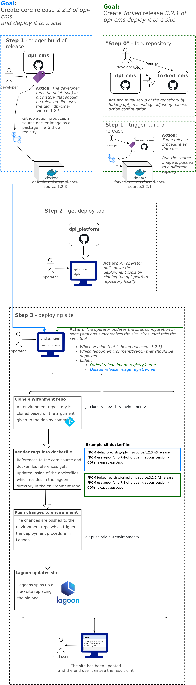

# Deploy a dpl-cms release to a site

## When to use

When you wish to roll out a release of [DPL-CMS](https://github.com/danskernesdigitalebibliotek/dpl-cms)
or a fork to a single site.

If you want to deploy to more than one site, simply repeat the procedure for each
site.

For sites with `plan: webmaster`, the branch `moduletest` for the test
environment for custom Drupal modules will also be synced appropriately.

## Prerequisites

* A [dplsh session](using-dplsh.md) with DPLPLAT_ENV exported and ssh-agent configured.
* a shell with a user that is authorized to interact with the [environment
  repositories](../platform-environments.md) in the github organisation used for
   the environment over ssh.
* The release-tag you whish to deploy, consult the readme in the dpl-cms repository
  for instructions on how to build an publish a release.

## Procedure

```sh
# 0. The easiest way to sync all sites is to run this single command:
task sites:sync

# Alternatively you can go through more granular sync'ing of individual sites...

# 1. Make any changes to the sites entry sites.yml you need.
# 2. (optional) diff the deployment
DIFF=1 SITE=<sitename> task site:sync
# 3a. Synchronize the site, triggering a deployment if the current state differs
#    from the intended state in sites.yaml
SITE=<sitename> task site:sync
# 3b. If the state does not differ but you still want to trigger a deployment,
#     specify FORCE=1
FORCE=1 SITE=<sitename> task site:sync
```

The following diagram outlines the full release-flow starting from dpl-cms (or
a fork) and to the release is deployed:

