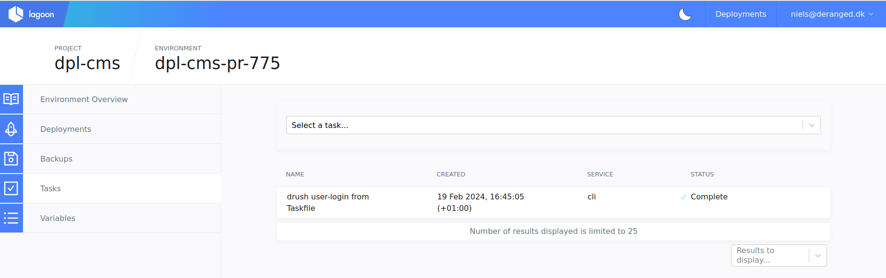

# UI: Synchronize site state

## When to use

If you want to synchronize state from one environment into another environment.

For example, you may want to synchronize state to a PR environment to run your
code in a more realistic setup.

Or you may want to synchronize a main (production) environment state to a
moduletest environment, if requested by the customer.

## Prerequisites

- A user with access to the relevant project through the
  [Lagoon UI](https://ui.lagoon.dplplat01.dpl.reload.dk/)

If you have access to the dpl-platform setup and can run task in the taskfile
(for platform engineers, not developers of the CMS) you may want to synchronize
site state using the related task (runbook WIP).

## Procedure

1. Go to the [Lagoon UI] website and log in
2. Navigate to the relevant project by selecting in the list
3. Pick the *target* environment in the list of environments. E.g. if you are
   synchronizing state from `main` to `pr-775` you should select `pr-775`.
4. In the left-hand side pick the "Tasks" menu point

Now you are at the tasks UI and can execute tasks for this environment. It
should look something like this:

Now we need to execute 3 tasks to synchronize the whole state and make it
available on visits to the target site:

<!-- markdownlint-disable-next-line MD029 -->
5. Run task "Copy database between environments \[drush sql-sync\]":

    - Select the task in the "Select a task..." dropdown.
    - Select the source environment. E.g. if you are synchronizing from `main` to
      `pr-775` select `main` in the dropdown.
    - Click "Run task" to start the task.  
      The task appears in the top of the list of tasks. You can click it to see
      log output. Once the task completes verify that the log output states that
      the synchronization worked.

<!-- markdownlint-disable-next-line MD029 -->
6. Run task "Copy files between environments \[drush rsync\]":

    - Select the task in the "Select a task..." dropdown.
    - Select the source environment as above.
    - Click "Run task" to start the task.  
      The task output can be viewed as described in point 5.  
      The task will fail. Verify that the error is a list of statements saying
      `> rsync: [receiver] failed to set times on ...`. As long as these are the
      only errors in the output, the synchronization succeeded.

<!-- markdownlint-disable-next-line MD029 -->
7. Run task "Clear Drupal caches \[drupal cache-clear\]" to clear the caches:

    - Select the task in the "Select a task..." dropdown.
    - Select the source environment as above.
    - Click "Run task" to start the task.  
      Once the task completes the environment has been fully synced and caches
      are cleared so the state will be reflected when you visit the site.  
      E.g. if you were synchronizing state from `main` to `pr-775`, the `pr-775`
      environment will now have the same state as `main`.
