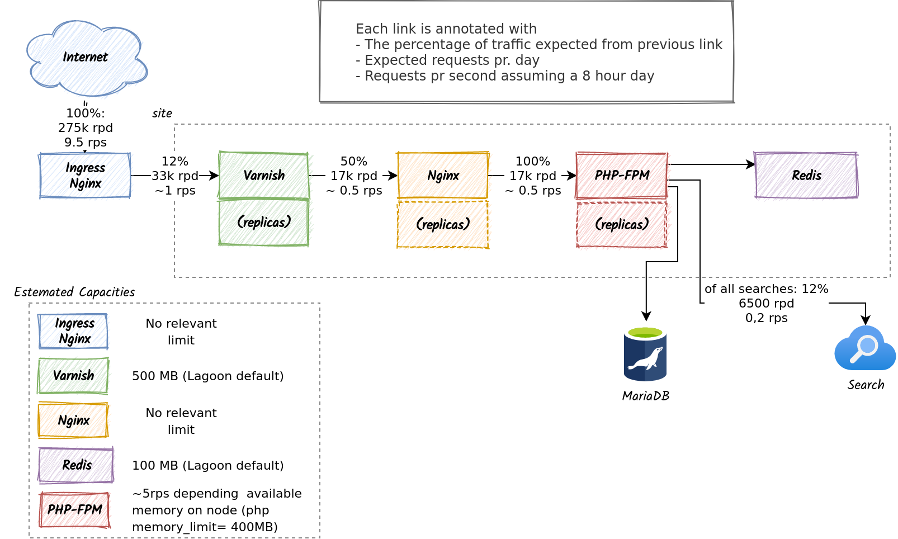

# Performance strategy

The DPL-CMS Drupal sites utilizes a multi-tier caching strategy. HTTP responses
are cached by Varnish and Drupal caches its various internal data-structures
in a Redis key/value store.

## The request-path

1. All inbound requests are passed in to an Ingress Nginx controller which
   forwards the traffic for the individual sites to their individual Varnish
   instances.
2. Varnish serves up any static or anonymous responses it has cached from its
   object-store.
3. If the request is cache miss the request is passed further on Nginx which
   serves any requests for static assets.
4. If the request is for a dynamic page the request is forwarded to the Drupal-
   installation hosted by PHP-FPM.
5. Drupal bootstraps, and produces the requested response.
6. During this process it will either populate or reuse it cache which is stored
   in Redis.
7. Depending on the request Drupal will execute a number of queries against
   MariaDB and a search index.

## Caching of http responses
Varnish will cache any http responses that fulfills the following requirements
* Is not associated with a php-session (ie, the user is logged in)
* Is a 200

Refer the [Lagoon drupal.vcl](https://github.com/uselagoon/lagoon-images/blob/main/images/varnish-drupal/drupal.vcl), docs.lagoon.sh documentation on [the Varnish service](https://docs.lagoon.sh/lagoon/drupal/services/varnish) and the [varnish-drupal image](https://docs.lagoon.sh/lagoon/docker-images/varnish/varnish-drupal) for the specifics on the service.

Refer to the caching documentation in [dpl-cms](https://github.com/danskernesdigitalebibliotek/dpl-cms)
for specifics on how DPL-CMS is integrated with Varnish.

## Redis as caching backend
DPL-CMS is configured to use Redis as the backend for its core cache as an
alternative to the default use of the sql-database as backend. This ensures that
 a busy site does not overload the shared mariadb-server.
