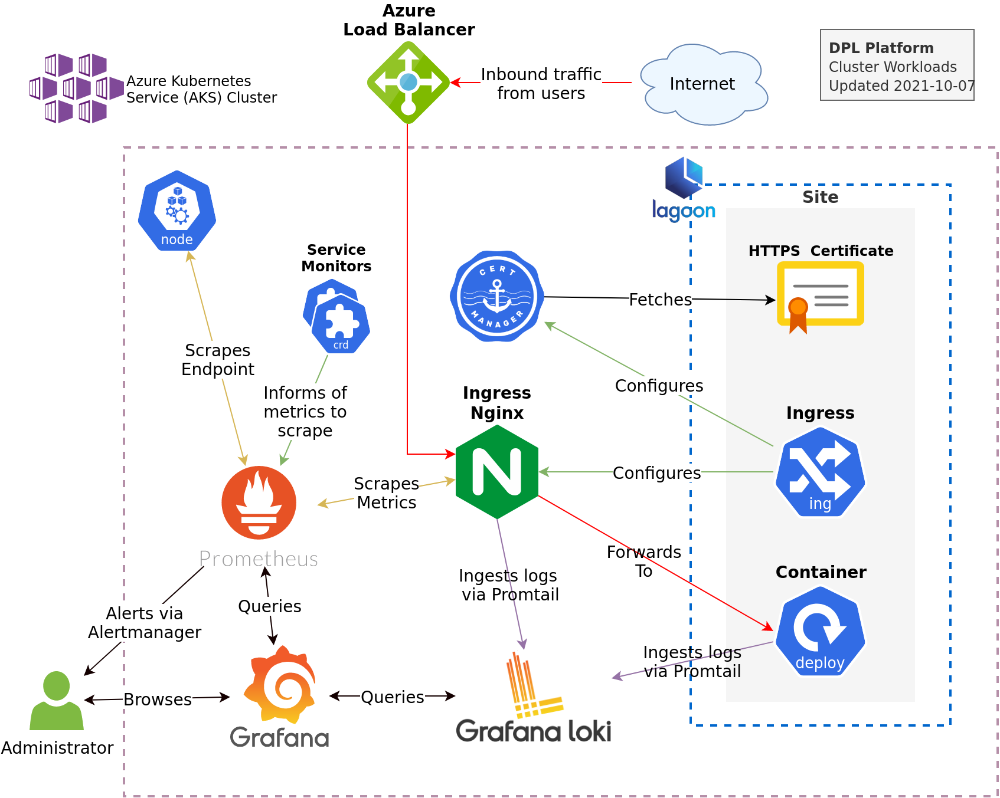
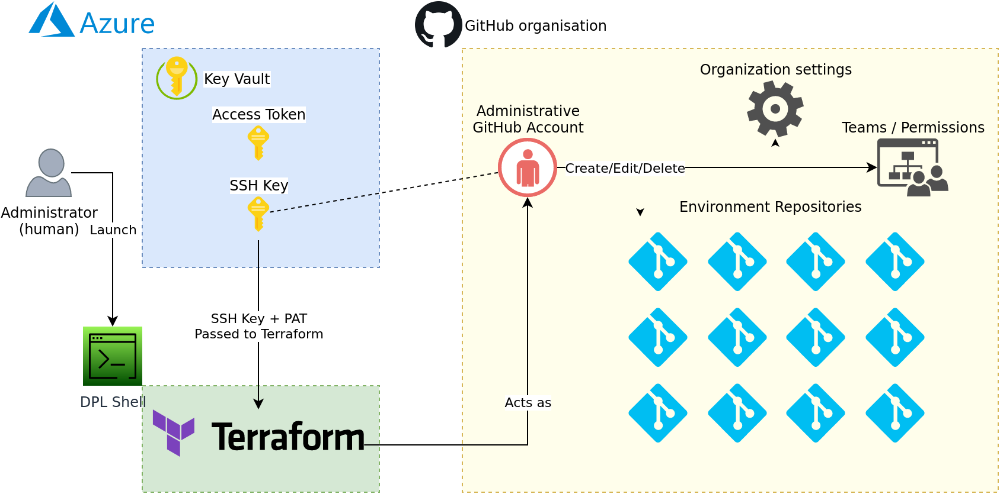

# A DPL Platform environment

A DPL Platform environment consists of a range of infrastructure components
on top of which we run a managed Kubernetes instance into with we install a
number of software product. One of these is [Lagoon](https://docs.lagoon.sh/)
which gives us a platform for hosting library sites.

An environment is created in two separate stages. First all required
infrastructure resources are provisioned, then a semi-automated deployment
process carried out which configures all the various software-components that
makes up an environment. Consult the relevant [runbooks](../runbooks) and the
[DPL Platform Infrastructure](../../infrastructure) documents for the
guides on how to perform the actual installation.

This document describes all the parts that makes up a platform environment
raging from the infrastructure to the sites.

* [Azure Infrastructure](#azure-infrastructure) describes the raw cloud infrastructure
* [Software Components](#software-components) describes the base software products
  we install to support the platform including Lagoon
* [Sites](#sites) describes how we define the individual sites on a platform and
  the approach the platform takes to deployment.

## Azure Infrastructure

All resources of a Platform environment is contained in a single Azure Resource
Group. The resources are provisioned via a [Terraform setup](../../dpl-platform/infrastructure/README.md)
that keeps its resources in a separate resource group.

The overview of current platform environments along with the various urls and
a summary of its primary configurations can be found the
[Current Platform environments](../platform-environments.md) document.

A platform environment uses the following Azure infrastructure resources.


* A virtual Network - with a subnet, configured with access to a number of services.
* Separate storage accounts for
  * Monitoring data (logs)
  * Lagoon files (eg. results of running user-triggered administrative actions)
  * Backups
  * Drupal site files
* A MariaDB used to host the sites databases.
* A Key Vault that holds administrative credentials to resources that Lagoon
  needs administrative access to.
* An Azure Kubernetes Service cluster that hosts the platform itself.
* Two Public IPs: one for ingress one for egress.

The Azure Kubernetes Service in return creates its own resource group that
contains a number of resources that are automatically managed by the AKS service.
AKS also has a managed control-plane component that is mostly invisible to us.
It has a separate managed identity which we need to grant access to any
additional infrastructure-resources outside the "MC" resource-group that we
need AKS to manage.

## Software Components

The Platform consists of a number of software components deployed into the
AKS cluster. The components are generally installed via [Helm](https://helm.sh/),
and their configuration controlled via [values-files](https://helm.sh/docs/chart_template_guide/values_files/).

Essential configurations such as the urls for the site can be found [in the wiki](https://github.com/danskernesdigitalebibliotek/dpl-platform/wiki/Platform-Environments)

The following sections will describe the overall role of the component and how
it integrates with other components. For more details on how the component is
configured, consult the corresponding values-file for the component found in
the individual [environments](../infrastructure/environments)  configuration
folder.



### Lagoon

[Lagoon](https://docs.lagoon.sh/lagoon/) is an Open Soured Platform As A Service
created by [Amazee](https://www.amazee.io/). The platform builds on top of a
Kubernetes cluster, and provides features such as automated builds and the
hosting of a large number of sites.

### Ingress Nginx

Kubernetes does not come with an Ingress Controller out of the box. An ingress-
controllers job is to accept traffic approaching the cluster, and route it via
services to pods that has requested ingress traffic.

We use the widely used [Ingress Nginx](https://kubernetes.github.io/ingress-nginx)
Ingress controller.

### Cert Manager

[Cert Manager](https://cert-manager.io/docs/) allows an administrator specify
a request for a TLS certificate, eg. as a part of an Ingress, and have the
request automatically fulfilled.

The platform uses a cert-manager configured to handle certificate requests via
[Let's Encrypt](https://letsencrypt.org/).

### Prometheus and Alertmanager

[Prometheus](https://prometheus.io/) is a time series database used by the platform
to store and index runtime metrics from both the platform itself and the sites
running on the platform.

Prometheus is configured to scrape and ingest the following sources

* [Node Exporter](https://github.com/prometheus/node_exporter) (Kubernetes
  runtime metrics)
* Ingress Nginx

Prometheus is installed via an [Operator](https://github.com/prometheus-operator/prometheus-operator)
which amongst other things allows us to configure Prometheus and Alertmanager via
 `ServiceMonitor` and `AlertmanagerConfig`.

[Alertmanager](https://prometheus.io/docs/alerting/latest/alertmanager/) handles
the delivery of alerts produced by Prometheus.

### Grafana

[Grafana](https://grafana.com/oss/grafana/) provides the graphical user-interface
to Prometheus and Loki. It is configured with a number of data sources via its
values-file, which connects it to Prometheus and Loki.

### Loki and Promtail

[Loki](https://grafana.com/oss/loki/) stores and indexes logs produced by the pods
 running in AKS. [Promtail](https://grafana.com/docs/loki/latest/clients/promtail/)
streams the logs to Loki, and Loki in turn makes the logs available to the
administrator via Grafana.

## Sites

Each individual library has a Github repository that describes which sites
should exist on the platform for the library. The creation of the repository
and its contents is automated, and controlled by an entry in a `sites.yaml`-
file shared by all sites on the platform.

Consult the following runbooks to see the procedures for:

* [Adding a site to the platform](../runbooks/add-site-to-platform.md)
* [Deploying to a site](../runbooks/deploy-a-release.md)
* [Removing a site](../runbooks/remove-site-from-platform.md)

### sites.yaml

`sites.yaml` is found in `infrastructure/environments/<environment>/sites.yaml`.
The file contains a single map, where the configuration of the
individual sites are contained under the property `sites.<unique site key>`, eg.

 ```yaml
sites:
  # Site objects are indexed by a unique key that must be a valid lagoon, and
  # github project name. That is, alphanumeric and dashes.
  core-test1:
    name: "Core test 1"
    description: "Core test site no. 1"
    # releaseImageRepository and releaseImageName describes where to pull the
    # container image a release from.
    releaseImageRepository: ghcr.io/danskernesdigitalebibliotek
    releaseImageName: dpl-cms-source
    # Sites can optionally specify primary and secondary domains.
    primary-domain: core-test.example.com
    # Fully configured sites will have a deployment key generated by Lagoon.
    deploy_key: "ssh-ed25519 <key here>"
  bib-ros:
    name: "Roskilde Bibliotek"
    description: "Webmaster environment for Roskilde Bibliotek"
    primary-domain: "www.roskildebib.dk"
    # The secondary domain will redirect to the primary.
    secondary-domains: ["roskildebib.dk", "www2.roskildebib.dk"]
    # A series of sites that shares the same image source may choose to reuse
    # properties via anchors
    << : *default-release-image-source
 ```

### Environment Site Git Repositories

Each platform-site is controlled via a GitHub repository. The repositories are
provisioned via Terraform. The following depicts the authorization and control-
flow in use:


The configuration of each repository is reconciled each time a site is created,

### Deployment

Releases of DPL CMS are deployed to sites via the [dpladm](../../infrastructure/dpladm)
tool. It consults the `sites.yaml` file for the environment and performs any
needed deployment.
