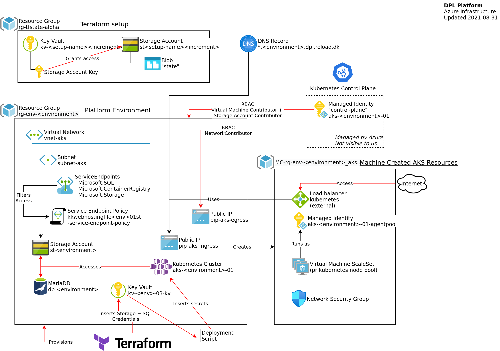

# A DPL Platform environment

All resources of a Platform environment is contained in a single Azure Resource
Group. The resources are provisioned via a [Terraform setup](../../dpl-platform/infrastructure/README.md)
that keeps its resources in a separate resource group.

An environment is created in two separate stages. First all required
infrastructure resources are provisioned, then a semi-automated deployment
process carried out which configures all the various software-components that
makes up an environment.

## Environment infrastructure.

Consulting the initial diagram in this document a platform environment contains
the following primary resources.

- A virtual Network - with a subnet, configured with access to a number of services.
- A Storage account used for storing logs and the file-shares the sites uses.
- A MariaDB used to host the sites databases.
- A Key Vault that holds administrative credentials to resources that Lagoon needs administrative access to.
- An Azure Kubernetes Cluster that hosts the platform itself.
- Two Public IPs: one for ingress one for egress.

The **Azure Kubernetes Cluster** in return creates its own resource group that
contains a number of resources that are automatically managed by the AKS service.
AKS also has a managed control-plane component that is mostly invisible to us.
It has a separate managed identity which we need to grant access to any
additional infrastructure-resources outside the "MC" resource-group that we
need AKS to manage.
