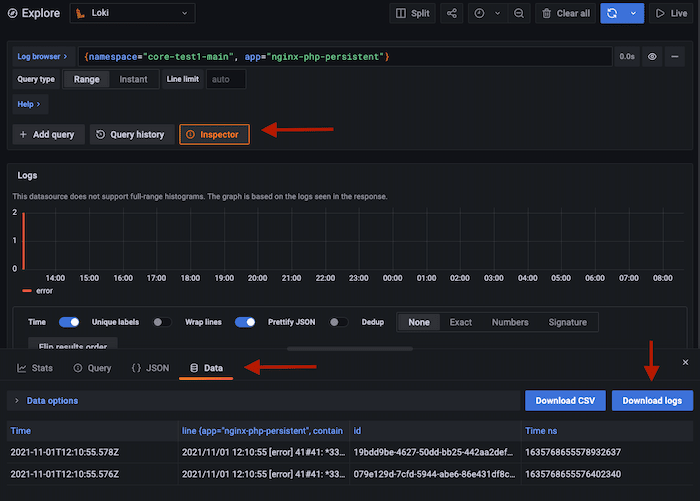

# Retrieve site logs

## When to use
When you want to inspects the logs produced by as specific site

## Prerequisites
* Login credentials for Grafana. As a fallback the password for the `admin` can
  password can be fetched from the cluster if it has not been changed via `kubectl get secret --namespace  grafana  grafana -o jsonpath="{.data.admin-password}" | base64 -d`. Consult the [access-kubernetes](access-kubernetes.md) Run book for instructions on how to
  access the cluster.

## Procedure - Loki / Grafana

1. Access the environments Grafana installation - consult the [platform-environments.md](../platform-environments.md) for the url
2. Select "Explorer" in the left-most menu and select the "Loki" datasource in the top.
3. Query the logs for the environment by either
   * Use the Log Browser to pick the namespace for the site. It will follow the pattern <sitename>-<branchname>
   * Do a custom [LogQL](https://grafana.com/docs/loki/latest/logql/), eg. to
     fetch all logs from the nginx container for the site "main" branch of the
     "rdb" site do  query on the form `{app="nginx-php-persistent",container="nginx",namespace="rdb-main"}`
   * Eg, for the  main branch for the site "rdb": `{namespace="rdb-main"}`
5. Click "Inspector" -> "Data" -> "Download Logs" to download the log lines.
