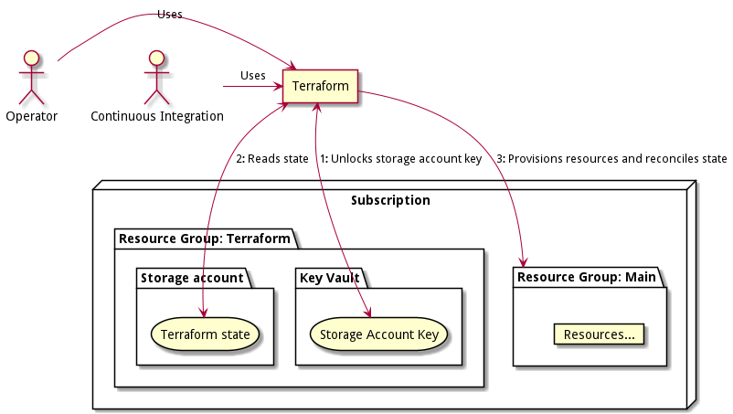

# DPL Platform Infrastructure
This directory contains the Infrastructure as Code and scripts that are used
for maintaining the infrastructure-component that each platform environment
consists of.

## Directory layout
* [environments/](environments): contains a directory for each platform environment. Read more
  below.
* [modules/](modules): The Terraform modules used to provision infrastructure for the
  individual environments.
* [scripts/](scripts): Shell-scripts used to perform the automation. The recommended way
   to invoke these is via task.
* [Taskfile.yml](Taskfile.yml): The [task](https://taskfile.dev) configuration. Involke `task`
  to get a list of targets.

### Environments
The `environments` directory contains a subdirectory for each platform
environment, and each directory has two subdirectories:
* `environments/<name>/infrastructure`: contains the terraform files needed to
   provision the basic infrastructure components that the platform requires.
* `environments/<name>/configuration`: contains the various configurations the
  applications that are installed on top of the infrastructure requires.

## Day to day use

Prerequisites:
* An properly authenticated azure CLI (`az`). See the section on initial
  Terraform setup for more details on the requirements

To provision/configure a given environment we use the [DPL shell](../../../dpl-platform/tools/dplsh)
which comes with all the tools we need. While it is possible to run the
commands described below outside of the shell, it is not supported.

First `cd` to the `infrastructure/terraform`, then launch the shell.

The shell will now launch, and authenticate against Azure.

While inside the shell, use `DPLPLAT_ENV=<name> task` to run the pieces of
automation you need.

Running `task` without any arguments will yield a list of targets.

```shell
$ cd infrastructure/terraform
$ dplsh
dplsh:~/host_mount$ DPLPLAT_ENV=dplplat01 task ...

# Eg.
dplsh:~/host_mount$ DPLPLAT_ENV=dplplat01 task infra:provision
```

Any applied changes is persisted into the environments remote state-file. This
means that you should be careful to coordinate when you commit changes to
`.tf` files to git with when they are applied. For dev/test environments it is
generally acceptable to `apply` and then commit when everything is applied
correctly. For test/production environments a more rigorous process with a
review of plans may be advisable.

## Setting up a new environment

The easiest way to set up a new environment is to create a new `environments/<name>`
directory and copy the contents of an existing environment replacing any
references to the previous environment with a new value corresponding to the new
environment.

When you have prepared the environment directory, launch `dplsh` and go through
the following steps:

```shell
# We export the variable to simplify the example, you can also specify it inline.
export DPLPLAT_ENV=dplplat01

# Provision the Azure resources
task infra:provision

# Provision the support software that the Platform relies on
task support:provision
```

## Terraform Setup
The setup keeps a single terraform-state pr. environment. Each state is kept as
separate blobs in a Azure Storage Account.



Access to the storage account is granted via a Storage Account Key which is
kept in a Azure Keyvault in the same resource-group. The keyvault, storage account
and the resource-group that contains these resources are the only resources
that are not provisioned via Terraform.

### Initial setup of Terraform
The following procedure must be carried out before the first environment can be
created.

Prerequisites:

- A Azure subscription
- An authenticated azure CLI that is allowed to use create resources and grant
  access to these resources under the subscription including Key Vaults.
  The easiest way to achieve this is to grant the user the `Owner` and `Key Vault Administrator`
  roles to on subscription.

Use the `scripts/bootstrap-tf.sh` for bootstrapping. After the script has been
run successfully it outputs instructions for how to set up a terraform module
that uses the newly created storage-account for state-tracking.

As a final step you must grant any administrative users that are to use the setup
permission to read from the created keyvault.

### Dnsimple

The setup uses an integration with DNSimple to set a domain name when the
environments ingress ip has been provisioned. To use this integration first
[obtain a api-key](https://support.dnsimple.com/articles/api-access-token/) for
the DNSimple account. Then use `scripts/add-dnsimple-apikey.sh` to write it to
the setups KeyVault and finally add the following section to `.dplsh.profile` (
get the subscription id and keyvault name from existing export for `ARM_ACCESS_KEY`).

```shell
export DNSIMPLE_TOKEN=$(az keyvault secret show --subscription "<subscriptionid>" --name dnsimple-api-key --vault-name <keyvault-name> --query value -o tsv)
export DNSIMPLE_ACCOUNT="<dnsimple-account-id>"
```
### Terraform Setups

A setup is used to manage a set of environments. We currently have a single that
manages all environments.

#### Alpha

- Name: alpha
- Resource-group: rg-tfstate-alpha
- KeyVault name: kv-dpltfstatealpha001
- Storage account: stdpltfstatealpha001

## Terraform Modules

We use a root "environment" module pr environment which in turn uses our main
platform module for provisioning.

Consult the general [environment documentation](../../documentation/platform-environment.md)
for descriptions on which resources you can expect to find in an environment and
how they are used.

Consult the [environment overview](environments/README.md) for an overview of
environments.

Consult the [module overview](modules/README.md) for an overview over our
modules.
