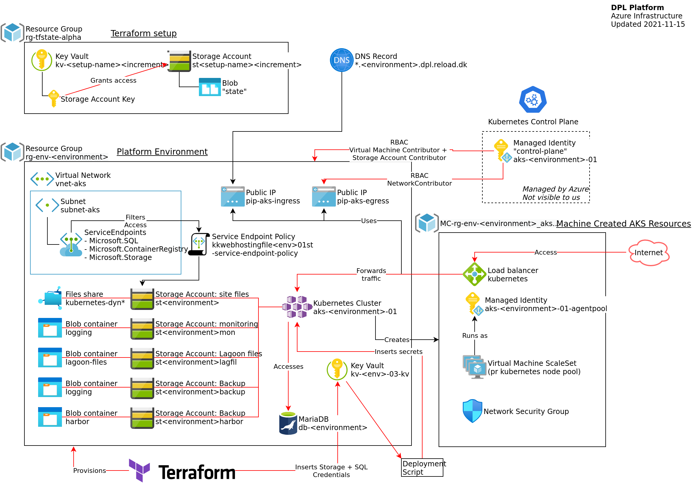

# Terraform Modules

We currently have a single module.

## DPL Platform Terraform Module

The [dpl-platform-environment](./dpl-platform-environment) Terraform module
provisions all resources that are required for a single DPL Platform Environment.

Inspect [variables.tf](./dpl-platform-environment/variables.tf) for a description of the required module-
variables.

Inspect [outputs.tf](./dpl-platform-environment/outputs.tf) for a list of outputs.

Inspect the individual module files for documentation of the resources.

The following diagram depicts (amongst other things) the provisioned resources.
Consult the [platform environment documentation](../../../documentation/platform-environment.md) for more details on the role the various resources
plays.

